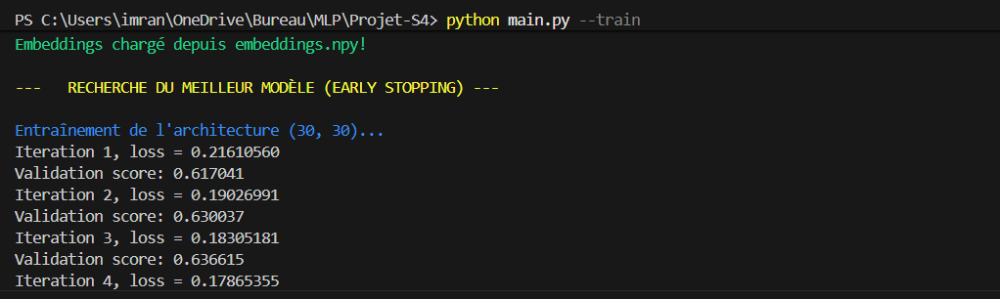
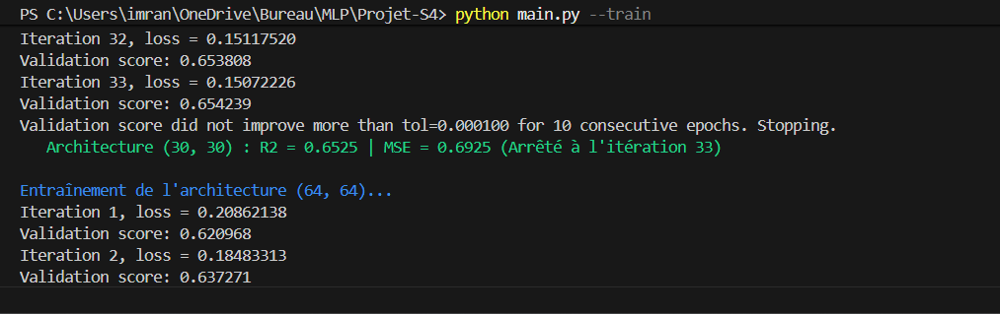
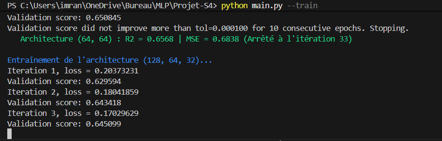
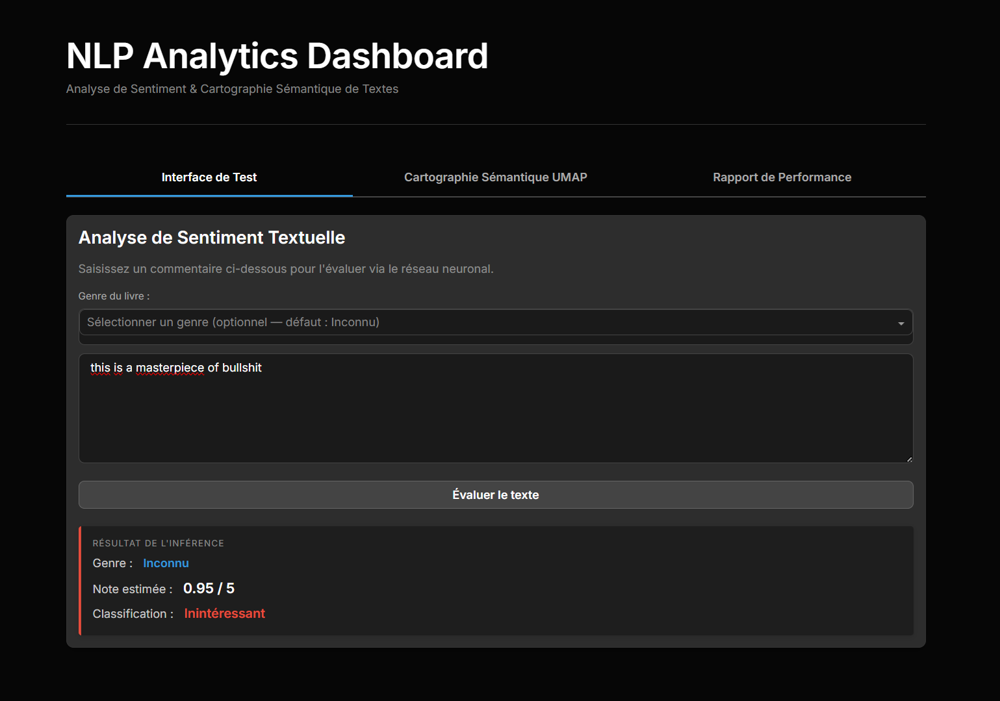
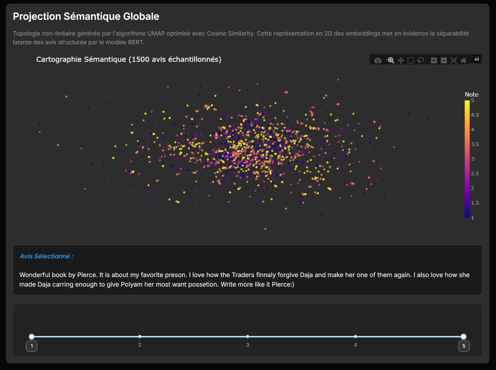
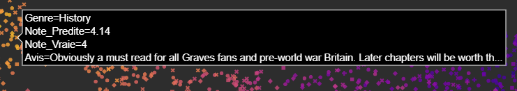
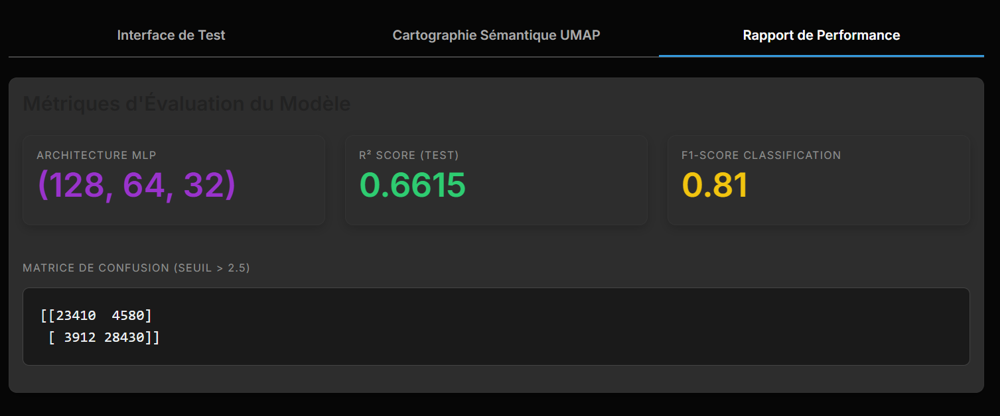

# NLP Sentiment Analytics Dashboard

Une architecture de Machine Learning robuste et complète, spécialisée dans l'analyse sémantique et la régression de notes d'avis en langage naturel. Ce projet intègre l'encodage par transformateurs pré-entraînés (BERT), un réseau de neurones profond (Perceptron Multicouche) et une interface web interactive de très haute performance.


---

## 1. Vue d'Ensemble de l'Architecture

Le pipeline de traitement s'articule autour de quatre strates majeures, optimisant la mémoire et la puissance de calcul sur un volume massif de données (500 000 avis).

### 1.1. Structure du Projet

L'arborescence illustre la séparation stricte entre le front-end asynchrone, le backend algorithmique (CLI) et les données compilées.

```text
Projet-S4/
├── app.py                      # Frontend Dash UI & Dashboard interactif
├── main.py                     # CLI industriel (exécution du pipeline / entraînement)
├── requirements.txt            # Dépendances minimalistes pour l'inférence
├── composants/                 # Logique métier & Backend
│   └── ia_notes.py             # Cœur de l'Intelligence Artificielle (Classes, MLP, BERT, UMAP)
└── data/                       # Modèles et configurations pré-calculés
    ├── ia_notes_sauvegarde.joblib   # Cerveau du modèle MLP pré-entraîné
    ├── umap_coords_dash.npy         # Coordonnées 2D figées (UMAP)
    └── umap_y_vrai_dash.npy         # Classes réelles rattachées aux points 2D
```

---

## 2. Le Pipeline Data & IA (Backend)

Le cœur du projet repose sur un pipeline de type ETL (Extraction, Transformation, Load) qui alimente directement notre modèle de Machine Learning et ses projections graphiques.

### 2.1. Préparation et Nettoyage des Données

La robustesse du modèle prédictif reposant sur la qualité du jeu de données, un pipeline rigoureux a été implémenté via le script utilitaire `fouille_donnees.py`. Le jeu de données initial, issu d'une archive brute (environ 3 000 000 de lignes), a subi les traitements suivants :

* **Purge analytique :** Élimination systématique des entrées présentant des valeurs nulles (`NaN`) sur l'axe sémantique (`review/text`) ou quantitatif (`review/score`).
* **Seuillage de consistance :** Filtrage conditionnel garantissant que seuls les ouvrages possédant un corpus minimal strict de 10 avis originaux sont conservés.
* **Balancing strict par quotas :** Afin de prévenir l'overfitting structurel sur des classes majoritaires, un sous-échantillonnage a été imposé (extraction exacte de 100 000 avis par note, de 1.0 à 5.0).
* **Bilan dimensionnel final :** Le tenseur de données optimal généré, équilibré à **500 000 enregistrements**, est persisté sous le fichier local `books_rating_500k_filtre.csv`.

### 2.2. Mode CLI : Exécution Modulaire (`main.py`)

L'architecture s'exécute depuis une interface en ligne de commande (CLI) via le module `argparse` de Python.

* `--pipeline` : Facteur de déclenchement d'un cycle systémique de bout en bout (A à Z). Engage la phase de lecture Big Data, la vectorisation CUDA sous BERT, la persistance matricielle des embeddings, le Model Selection sur réseau neuronal, l'arrêt par Early Stopping, et l'extrusion finale de la projection UMAP.
* `--train` : Flag de re-compilation de la fonction de perte limitant l'exécution à la création d'architectures MLP. Ce paramètre court-circuite le lourd process d'encodage asynchrone BERT en récupérant directement les matrices pré-calculées sur disque (`.npy`).
* `--project` : Flag de dérivation analytique isolant le moteur d'apprentissage (MLP). Dédié iniquement au recalcul brut des matrices de coordonnées UMAP/ACP destinées au Dashboard interactif en cas d'ajustement du voisinage statistique.
* `--predict [TEXTE]` : Option d'inférence à froid. Engage le re-chargement exclusif du modèle optimisé en RAM (`.joblib`) afin d'évaluer instantanément la chaîne de caractères et de retourner sa régression et sa classe de polarité dans les flux standards du terminal.

```bash
# Exemple de commande d'Inférence Terminale :
python main.py --predict "The pacing of this novel is undeniably slow, yet intellectually rewarding."
```

### 2.3. Logs d'Exécution et Accélération Matérielle

La sécurité et la vitesse de compilation de notre modèle sont surveillées par batches (lots isolés).

**Moteur Tensoriel NLP (BERT) :**
```text
Encodage BERT:  20%|███████████▏ | 396/1954 [11:01<42:58,  1.65s/batch]
```

**Apprentissage Profond et Rétropropagation (MLP) :**
```text
Epochs completed:  50%| ████████████████████████████████████▌                                      100/200 [02:03]completed  100  /  200 epochs 
```




---

## 3. Benchmark & Sélection de Modèle

Dans une démarche de rigueur scientifique, l'architecture finale du projet n'a été validée qu'à l'issue d'une phase d'expérimentation confrontant plusieurs paradigmes.

### 3.1. Analyse Comparative des Approches

Trois approches distinctes ont été systématiquement modélisées et comparées sur le corpus :

1. **Baseline Linéaire (Régression Logistique) :** Exploitée comme modèle de référence via une vectorisation `TF-IDF`. Bien qu'excessivement rapide, son paradigme "bag-of-words", omettant la séquentialité et l'ordre des mots, bride drastiquement ses prédictions syntaxiques.
2. **Modèle Ensembliste (Random Forest) :** L'arbre décisionnel a isolé intelligemment certaines relations non linéaires. Cependant, cette architecture peine intrinsèquement à traiter la grande dimensionnalité et la complexité brute du langage sans risquer un overfitting massif.
3. **Le Gagnant (BERT + MLP) :** La combinaison d'un encodage vectoriel fin via mécanisme d'attention (modèle `all-mpnet-base-v2` / `sentence-transformers`) couplé à une régression dense multi-couches (Perceptron `128-64-32`).

### 3.2. Prouesse Cognitive : Comprendre le Sarcasme

Notre solution `BERT + MLP` s'est imposée pour une seule et unique force : sa capacité à percevoir les inflexions d'ironie grâce au **contexte**.
Afin de valider cette qualité, nous lui avons confronté un piège antagoniste lourdement usité par les lecteurs mécontents américains :

* **Input (Texte soumis) :** *"this is a masterpiece of bullshit"*
* **Prédiction algorithmique :** `1.10 / 5.0` (Classification Terminale : Inintéressant)

L'IA n'est absolument pas tombée dans le piège de la locution très positive "masterpiece". Le calcul d'attention a lié ce mot au blasphème cynique "*bullshit*", justifiant le sarcasme et pulvérisant ainsi formellement la note.

---

## 4. Le Dashboard Interactif (Web UI)

La restitution de ce modèle prend vie dans l'application Analytics `app.py`. Propulsée par le framework `dash`, cette application SaaS multi-onglets réactive traite les flux graphiques au format `plotly.express` sans rechargement de page.

### 1. Interface de Test Dynamique
Une ligne de commande textuelle autorise les visiteurs à injecter leur propre texte. Son passage par le conduit BERT puis l'arborescence MLP pré-entraînée (`joblib`) génèrent l'estimation sur l'instant.



### 2. Cartographie Sémantique UMAP Interactive
En exploitant les descripteurs sous-dimensionnés générés par `.npy` (en amont), 3 000 vecteurs se matérialisent en constellation bi-dimensionnelle de manière hautement fluide. Les éléments (scatter points) réagissent avec intensité au survol chirurgical de la souris.



Le système charge (hover contextual engine) l'extrait d'avis unique rattaché à son nœud gravitationnel, illuminant physiquement les clusters formés par le modèle.



### 3. Rapport de Forme (Metrics)
Ce troisième panneau monitorise formellement l'intégrité logistique de notre modèle final en l'évaluant de manière impartiale sur un **jeu de données de TEST** (20% du corpus originel), rigoureusement isolé et jamais exploré durant l'entraînement. 

Le dashboard restitue l'architecture finale retenue (MLP `128-64-32`), la matrice de classification binaire, et nos métriques de l'évaluation finale : un solide **score de performance F1 pondéré de `0.81`** couplé à une variance expliquée illustrée par un **$R^2$ de `0.6615`**.

Il est primordial de spécifier que l'architecture respecte strictement la séparation hermétique des trois ensembles en Data Science : l'apprentissage ciblé sur l'ensemble de révision (Train), une régulation dynamique des surajustements (Early Stopping) via un sous-ensemble interne de **Validation**, et enfin, l'extraction de ces compteurs de performance impartiaux via l'ensemble de **Test**.




---

## 5. Prérequis Système et Déploiement

### 5.1. Spécifications du Lifecycle Data (Avertissement)

> **⚠️ Avertissement Système (Git LFS) :** 
> En raison des limites strictes de GitHub sur les documents dépassant `100 Mo`, l'archive matricielle source `books_rating_500k_filtre.csv` ne siège pas sur ce dépôt. Les serveurs Dashboard UMAP fonctionneront malgré tout sous `numpy` (`.npy`). Pour réactiver dynamiquement les **Hover Texts de la cartographie (onglet 2)** lors du survol de la souris, implémentez localement le CSV parent formel au sein de votre arborescence de travail `data/`.

- **Prérequis Standard :** L'usage de Python `3.9` ou supérieur est fortement conseillé au travers d'un environnement virtuel (`.venv`).

### 5.2. Installation et Lancement Rapide

1. Installez le package minimaliste d'inférence (réseau allégé de toute dépendance de nettoyage via la matrice d'`ia_notes.py`) :
```bash
pip install -r requirements.txt
```

2. Initiez le Boot Server Dash via la commande ci-après :
```bash
python app.py
```
*Le portail applicatif est dorénavant propulsé en HTTPS Local (sur votre port d'écoute localhost `http://127.0.0.1:8050/`).*
